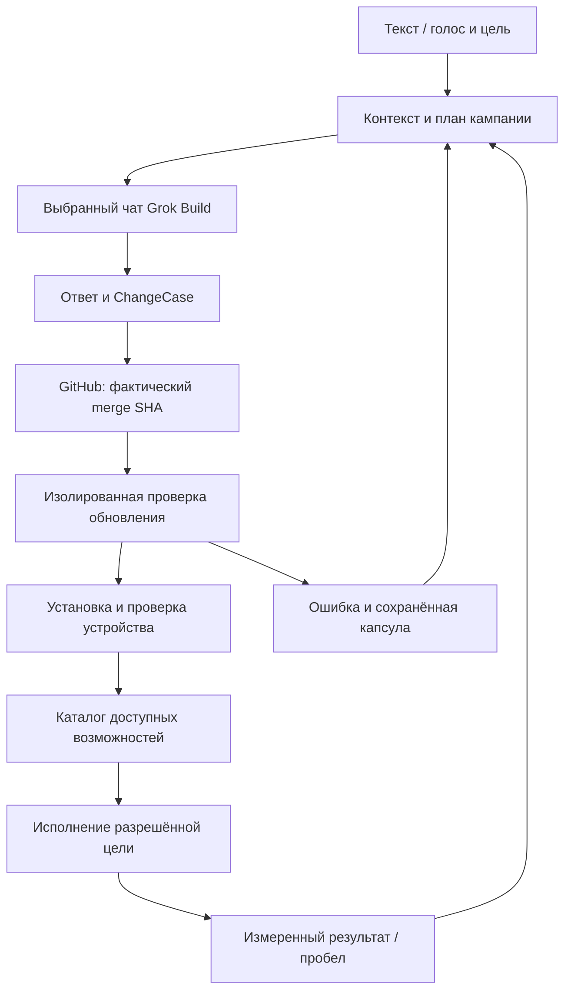

# Один запуск кампании: контекст → Grok Build → проверенная возможность

Редакция V4, 2026-10-04. Эта стратегия объединяет дальнейшую разработку local
context library, Voice AgentOS, Laya и сценария двух выбранных вкладок. Исходные
каталоги, формулировки и планы V1–V3 сохраняются. Статусы ниже относятся к текущей
проверке, а прежние документы сохраняют свои даты.

## Что пользователь в итоге делает один раз

Пользователь открывает локальное приложение, выбирает папку проекта и связанные
источники, произносит или пишет цель. Затем показывает конкретный чат Grok Build
и нужную страницу GitHub. Приложение показывает состав автоматизации: какие данные
она передаёт, какой репозиторий и ветку обновляет, какие проверки обязательны,
когда может повторять действия и когда обязано остановиться. После настройки
области действий кнопка «Запустить кампанию» ведёт весь разрешённый цикл.

Один запуск означает сохранённую кампанию с продолжением после перезапуска.
Она может породить несколько связанных запросов и обновлений. Один ZIP является
полным пакетом стратегии и контекста для дальнейшей разработки; он сам не
устанавливает все будущие adapters и не снимает ограничения окон AI.

## Что уже реализовано в этой итерации

В SCE добавлены постоянная карточка задачи, неизменяемый TASK, журнал ручной
передачи с защитой от повторов, импорт связанного результата, проверка локальных
тестов по операторскому template и UI этих операций. Они используют существующий
SQLite/review/Core. Локальный commit: `5574ab768b39605d4631651a1e8f2451483344db`.
Все 381 локальный regression test прошли. Полный inventory текущего исходного
main содержит 157 файлов; его проверили отдельно без запуска кода источников.

Публикация нового кода заблокирована автоматической проверкой разрешений:
для отправки кода в GitHub требуется явное разрешение пользователя. PR и CI на
новой ревизии не созданы. Изменение доступно отдельным локальным patch; здесь
сохранены его SHA и ссылка на владельца кода, а не ещё одна копия репозитория.

Grok UI, voice на устройстве, модель Laya, updater и управление произвольными
программами ещё не подключены. Текущий работающий путь переносит документ вручную.
`LOCAL_TESTS_VERIFIED` не означает merge, установленное обновление или доказанную
семантическую истинность произвольного критерия.

## Полный путь продукта

Каждая стрелка имеет идентичность входа, версию, наблюдение и условие готовности.
Выход без этих данных остаётся неопределённым или неполным. Нельзя заменить
фактический merge фразой «я merged» либо заменить installation receipt успешным
тестом в отдельном worktree.

## Очередность разработки с измеримой готовностью

| Этап | Результат для пользователя | Зависимость | Готовность |
| --- | --- | --- | --- |
| S0. Принять локальное изменение | TASK и результаты не теряются | Публикация/поставка текущего commit | Проверен точный доставленный SHA; 381 локальная проверка и затем CI/Windows отдельно |
| S1. Полный repo-chunker | Одна кнопка сканирует весь snapshot до конца | Существующий inventory/cursor | Каждый entry учтён; bytes INDEXED восстанавливаются; остальные имеют причины |
| S2. Связанные пакеты | Код, зависимости, тесты и контракты группируются для AI | S1, языковые adapters | Проверены пути/версии, group graph и отсутствие необъявленных пропусков |
| S3. Локальный каталог | Найти нужный контекст по цели, времени, проекту и источнику | Существующий store, S1 | Поиск возвращает точные исходники; пользовательские метки сохраняются |
| S4. Связать две вкладки | Пользователь показывает чат и GitHub один раз | Current-task UI, target binding | Переключение аккаунта/чата/репо выявляется до внешнего эффекта |
| S5. UI доставка и возврат | TASK появляется в выбранном чате; ответ возвращается | S2, S4, qualified adapter | Отправка/вложения проверены; unknown не повторяется автоматически |
| S6. Изменение и merge | Каждый результат связан с конкретным PR/commit | S5, тестовые profiles | Подтверждены итоговая ревизия, обязательные проверки и merge relation |
| S7. Обновление приложения | Новые возможности появляются после проверки | S6, release/staging/rollback | Проверена установленная сборка, миграция, canary и действие на устройстве |
| S8. Voice + Laya | Текст и голос управляют одним планом | S3–S7, capability registry | Ошибочная/неуверенная речь не меняет цель; keyboard STOP работает независимо |
| S9. Параллельный R&D | Независимые исследования идут одновременно | Snapshot manifests, leases, admission | Разные workers не меняют один ресурс; интеграция и UI сериализованы |
| S10. Долговременная память | Документы/чаты/медиа пополняют личный контекст | Source versions, extraction contracts | Источник, полнота, spans, происхождение и область передачи сохранены |
| S11. Новые навыки и эксперименты | Неизвестная возможность превращается в разработку | Проверенный цикл S0–S10 | Новая capability проходит собственную qualification перед использованием |

Это порядок зависимости, не календарное обещание. S3 и проектирование S4 могут
идти параллельно с S1–S2. До qualified S5 доставка остаётся ручной; продолжение
разработки библиотеки от этого не блокируется. До S9 production Core сохраняет
текущий `max_parallel=1`; reference planner V3 не считается deployed scheduler.

## Две вкладки и автономное обновление

Таблица связывания хранит выбранный target, тип UI/документа, аккаунт/workspace,
идентичность чата/репозитория, session revision и последнюю qualification.
Browser tab ID сам по себе недостаточен после рестарта. Если устойчивый ID
недоступен, приложение явно требует повторного связывания, а не угадывает адресат.

Документ в Grok содержит цель, требования, связанные части, declared gaps,
точный repo SHA, критерии и формат возврата. Источник не может подменять scope
операции или незаметно выбирать другой чат. Доступ модели к GitHub является
отдельно наблюдаемой возможностью выбранного окружения, а не предположением
приложения. Если такого доступа нет, результатом становится patch/PR candidate
для разрешённого интегратора или пользователя.

Во вкладке GitHub приложение наблюдает конкретный repo/PR/branch/commit. После
merge оно получает immutable source или release, сопоставляет SHA и содержимое,
создаёт staging checkout, выполняет только заранее зарегистрированные проверки,
готовит миграцию и точку возврата. Активная установленная версия меняется лишь
после этих шагов. Появление файла в Downloads не подтверждает установку.

Постоянная настройка scope позволяет повторять разрешённые шаги без одинаковых
вопросов. Изменение repo, аккаунта, действий, расходных лимитов или требуемых
полномочий становится видимым изменением плана. Таймер и ответ AI не расширяют
этот scope. При ошибке система сохраняет максимум завершённых подготовительных
шагов и запрашивает только недостающее решение.

Подробные состояния, отказные сценарии и карточки: `two_tabs/`.

## Что делает Laya в repo-chunker

Сканирование Git, SHA, offsets, graph traversal, упаковка, фильтры и полнота
проверяются локальными детерминированными функциями. Laya — планируемый сменный
адаптер для коротких решений: классифицировать цель, предложить релевантные
группы, выбрать следующий допустимый шаг, вернуть uncertain. Он не заменяет
полный inventory и не получает неограниченное выполнение shell из текста.

Приоритет ближайшей автоматизации: `Scan entire repo` продолжает существующий
cursor до EOF, формирует единый manifest всех частей и группирует связанные
файлы вместе с тестами/контрактами. Затем delta compiler обновляет только
затронутые группы, а многотомный handoff ведёт журнал подготовленных, переданных,
полученных и заявленных как использованные частей. Эти четыре статуса разные.

Добавляются JS/TS imports/exports, workspace/alias manifests, ambiguity report,
тесты cross-language boundaries, история ошибок и отчёт WHY_THIS_PACKET.
Если граф не разрешён, chunk остаётся доступным для исследования с явным пробелом.
Подробные задачи, эксперименты и limits: `laya/`.

## Контекст всей жизни

Архив может расти независимо от одного окна AI. Сохраняются оригиналы и версии,
а для конкретной цели собирается ограниченный ContextPacket с индексом остальных
источников и протоколом дозапроса. «Бесконечный контекст» здесь означает длительно
пополняемый и доступный для поиска архив, а не физически бесконечную память модели.

Источник → оригинал → извлечение → chunks → автоматические/ручные метки →
представления → выбранная передача имеют отдельные identity и версии. Ошибка
OCR не меняет исходный PDF, исправление метки человеком не пропадает при новом
запуске модели. Удаление/retention учитывают производные, backup и уже переданные
копии; приложение не обещает отменить внешнюю передачу задним числом.

Короткий запрос «собери контекст по проекту X» выбирает не всю личную историю,
а источники, относящиеся к цели и выбранной области. UI показывает причину выбора,
пропуски, размер и назначение. Для совместной работы экспортируется выбранная
проекция с manifest, а не автоматически весь локальный архив.

## Как повышать долю успешных автоматизаций

Главный показатель — доля попыток, закончившихся независимо проверенным
пользовательским результатом, среди всех начатых попыток. Неизвестные исходы,
отмены, повторы и ручные вмешательства учитываются отдельно и не исчезают из
знаменателя. Число файлов, карточек, вызовов AI и заявлений DONE не заменяет пользу.

Для каждой capability собирают корпус обычных задач и отказов: смена вкладки,
истёкшая авторизация, частичный upload, перезапуск процесса, stale SHA, неуспешный
тест, конфликт merge, заполненный диск, прерванная миграция, ошибочное распознавание
речи. Стратегия продвигается после воспроизводимой проверки на фиксированном корпусе.

Начальные критерии пилота являются целями измерения: 100% учтённых Git entries;
0 необъявленных пропусков; 0 внешних duplicate effects в fault corpus; 100% stale
evidence обнаружено в предусмотренных случаях; каждый успешно установленный
release имеет device receipt. Время поиска, остановки, RAM, throughput и качество
голосовых intents измеряются на Dell 16 ГБ и публикуются с размером корпуса.

## Сохранение всех идей и следующая работа

`catalogs/ALL_164_FEATURES_PROGRESS.json` содержит отдельную запись для каждой
унаследованной продуктовой карточки с её зависимостями, критерием и следующим
экспериментом. Это не новая оценка готовности всех 164 функций. Trading/replay,
внешние media collectors, новые навыки и прочие поздние направления сохраняются
как самостоятельные ветви; общий UI-цикл не даёт им неявного доступа к выполнению.

`catalogs/ALL_TASKS_V4.json` объединяет 80 задач V3 и новые детальные уточнения.
`catalogs/V3_PROGRESS_OVERLAY.json` показывает частичное продвижение существующих
карточек без переписывания их исторического статуса. `implementation/STATUS.json`
отделяет локальный код, CI, публикацию, установленную версию и план.

Первый дальнейший PR после доставки текущего изменения: S1 — одна кнопка
полного сканирования с cancel/resume и manifest всех частей. Параллельно можно
готовить binding двух вкладок без отправки данных. Затем первый внешний canary:
маленький тестовый документ в явно выбранный Grok chat с наблюдаемым результатом,
возвратным ID и проверкой отсутствия повторной отправки.
